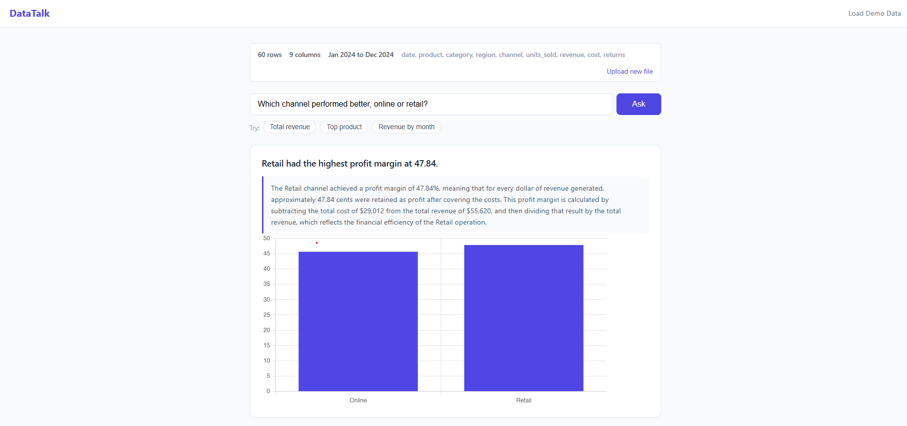
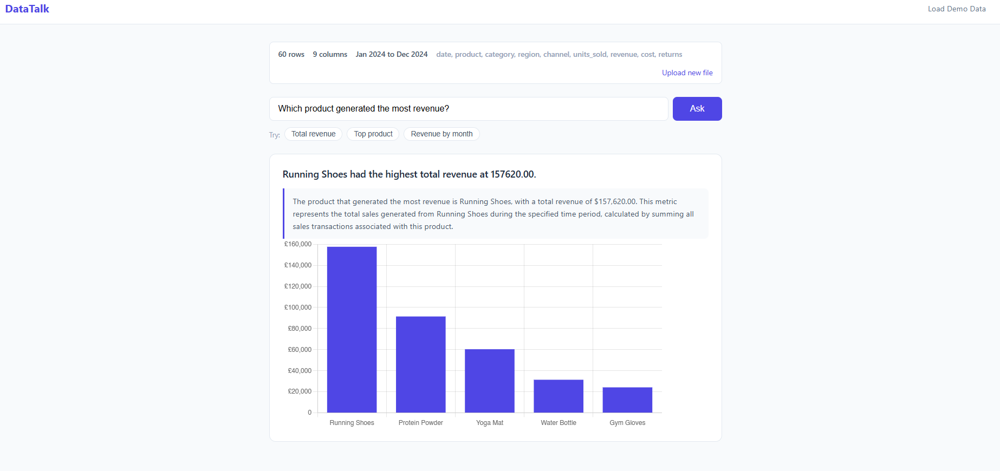
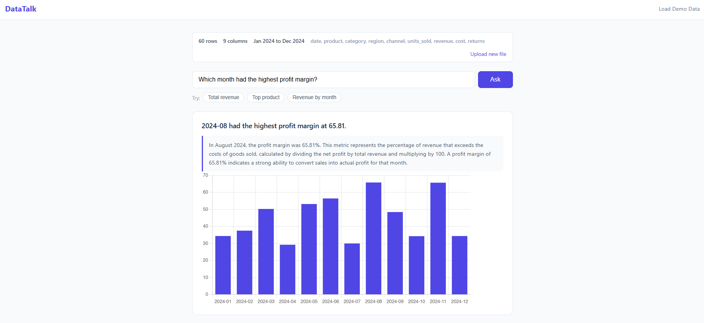
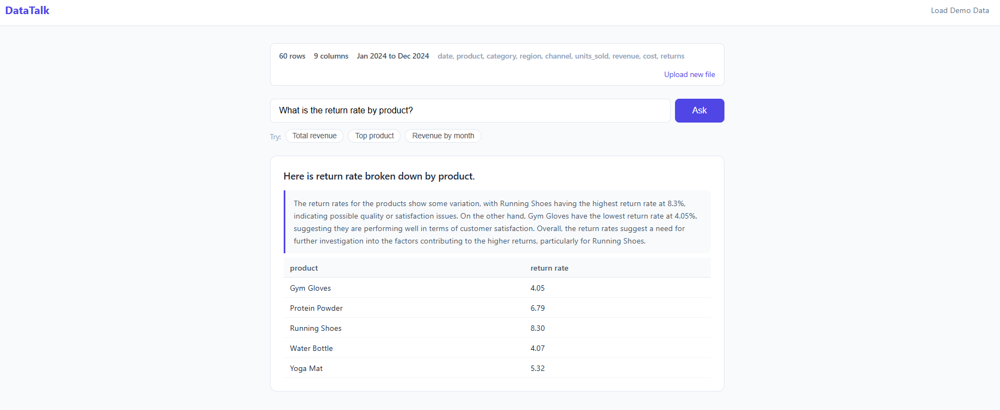
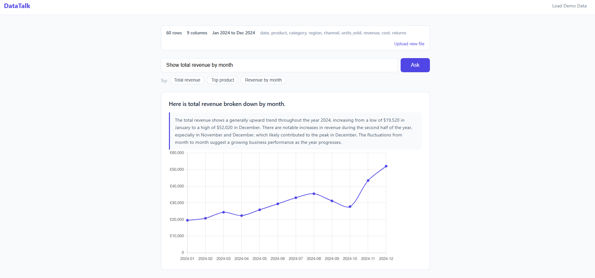
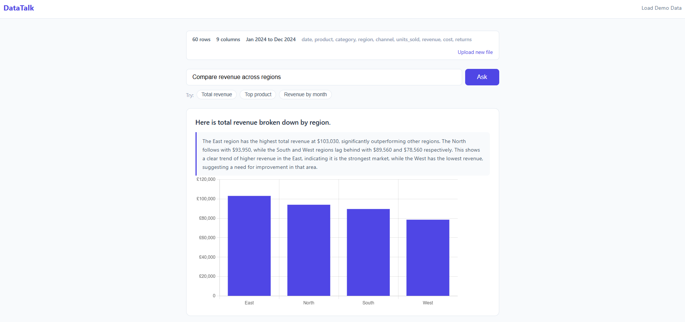

# DataTalk — AI-Powered Business Dashboard

A web application that lets non-technical users query business data
in plain English. Upload any CSV, ask questions naturally,
and get answers with automatic chart visualisation.

## Screenshots

<table>
  <tr>
    <td></td>
    <td></td>
  </tr>
  <tr>
    <td></td>
    <td></td>
  </tr>
  <tr>
    <td></td>
    <td></td>
  </tr>
</table>

## What it does

- Upload any CSV file — no formatting required
- Ask questions in plain English ("Which product had the
  highest revenue in Q3?")
- Calculates derived metrics dynamically — ask about profit margin,
  return rates, or revenue per unit even if those columns don't exist
  in your CSV. The AI generates the formula and runs it against your
  raw data automatically.
- OpenAI converts the question to SQL and runs it against your data
- Results displayed as bar, line, or pie charts where relevant,
  or as a table for complex queries
- Query history lets you revisit previous questions
- Pre-loaded demo dataset so you can try it instantly

## Example questions

With the demo sales dataset loaded:
- "What month had the highest profit margin?" *(calculated dynamically
  from revenue and cost columns)*
- "Which product generated the most revenue?"
- "Show total revenue by month"
- "What is the return rate by product?" *(calculated dynamically
  from returns and units sold)*
- "Compare revenue across regions"
- "Which channel performed better, online or retail?"

## Tech stack

- **Backend:** Python, Flask
- **Database:** SQLite (dynamically generated from uploaded CSV)
- **AI:** OpenAI GPT-4o-mini (natural language to SQL)
- **Frontend:** HTML, CSS, JavaScript
- **Charts:** Chart.js
- **Data processing:** Pandas

## How it works

1. User uploads a CSV file
2. Pandas reads the file and auto-detects column names and data types
3. Data is loaded into a SQLite table dynamically
4. User submits a question in plain English
5. A first OpenAI call converts the question to SQL and detects
   the appropriate chart type
6. The SQL runs against SQLite and results are returned
7. A second OpenAI call generates a plain English explanation
   grounded in the actual query results
8. Chart.js renders the appropriate visualisation in the browser

## Design decisions

- **Schema auto-detection** means any well-formed CSV works without
  pre-formatting. Column names are cleaned and normalised on upload.
- **Two-stage AI pipeline** separates SQL generation from explanation
  generation, ensuring the explanation always references real query
  results rather than hallucinated data.
- **Question intent detection** distinguishes ranking questions
  ("which month had the highest margin?") from display questions
  ("show revenue by month"), adjusting the headline and explanation
  style accordingly.
- **Smart column selection** prioritises percentage and margin columns
  when multiple numeric columns are returned, so charts always display
  the most meaningful metric.
- **Dynamic metric calculation** means users are not limited to columns
  that exist in their data. The AI understands analytical intent and
  writes SQL that computes derived metrics such as profit margin,
  return rate, and growth percentages from raw revenue and cost columns.
- **GPT-4o-mini** was chosen over GPT-4o for cost efficiency.
  For a data query tool, the smaller model performs well.
- **Session-based state** stores the schema and query history
  between requests without requiring user accounts or a persistent
  database.
- **Separate demo_data.py** keeps data out of application logic,
  following standard Python project structure.
- **Error handling** at both the OpenAI and SQL layers means
  unanswerable questions return helpful messages rather than crashes.

## Setup

### Prerequisites
- Python 3.10+
- OpenAI API key

### Installation
```bash
git clone https://github.com/joshuakon-git/datatalk
cd datatalk
pip install -r requirements.txt
```

### Configuration

Create a `.env` file in the project root:
OPENAI_API_KEY=your_key_here
SECRET_KEY=your_secret_key_here

Generate a secret key with:
```bash
python -c "import secrets; print(secrets.token_hex(32))"
```

### Run locally
```bash
python app.py
```

Visit `http://127.0.0.1:5000`

## Project structure
```
datatalk/
├── app.py              # Flask routes and core logic
├── config.py           # Configuration and environment variables
├── demo_data.py        # Demo CSV dataset
├── requirements.txt    # Python dependencies
├── static/
│   ├── css/
│   │   └── style.css   # Styling
│   └── js/
│       └── charts.js   # Chart rendering and query logic
├── templates/
│   ├── layout.html     # Base template
│   ├── index.html      # Upload page
│   └── dashboard.html  # Query and results page
├── uploads/            # Temporary CSV storage
└── instance/           # SQLite database (auto-generated)

## Limitations and future improvements

- Session storage means data resets on server restart.
  A production version would use persistent user accounts.
- Large CSVs (100k+ rows) may be slow. Adding pagination
  or chunked loading would improve performance.
- Currently supports single-table queries only.
  Multi-CSV joins would be a natural extension.
- The OpenAI prompt could be improved with few-shot examples
  for more complex analytical questions.

## Author

Joshua Kon
[linkedin.com/in/joshua-kon](https://linkedin.com/in/joshua-kon)
[github.com/joshuakon-git](https://github.com/joshuakon-git)
